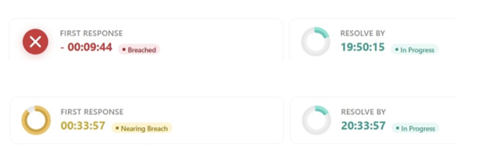
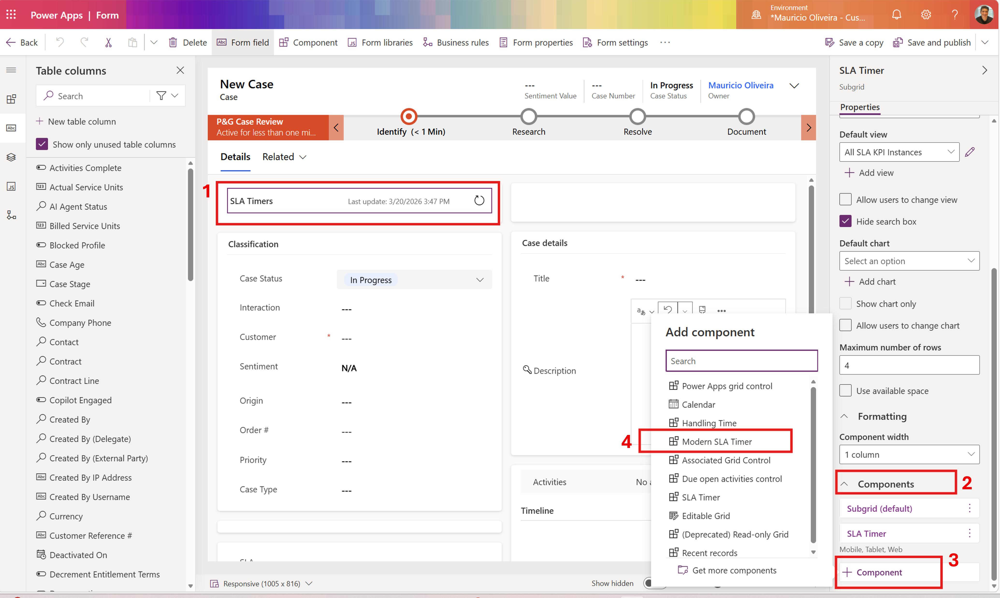
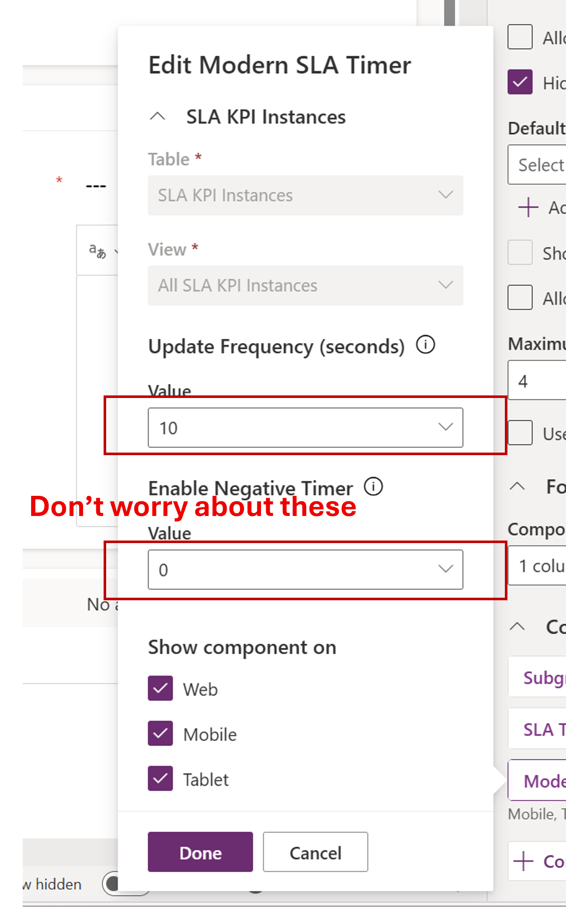

# Modern SLA Timer - PCF Control for Dynamics 365

A **Power Apps Component Framework (PCF)** control that replaces the default SLA Timer on Dynamics 365 Case forms with a modern, visually appealing experience. It displays SLA KPI instances as cards with animated donut charts, real-time countdown timers, and color-coded status badges.



## What It Does

This control binds to the **SLA KPI Instances** subgrid on a Case form and renders each SLA KPI as a compact card showing:

- **Animated dual-ring donut chart** for in-progress and nearing-breach KPIs
- **Real-time countdown** (updates every second) showing time remaining until SLA breach
- **Status badges** with color coding: In Progress (teal), Nearing Breach (amber with pulse animation), Breached (red), Succeeded (green with animated checkmark), Paused (gray), Cancelled (gray)
- **Automatic status transitions** — the control detects when warning or failure times are reached and updates the visual in real time
- **Negative countdown after breach** — breached KPIs always display a negative countdown showing elapsed time past the SLA deadline

## Control Properties

| Property | Description | Default |
|---|---|---|
| **SLA KPI Instances** (dataset) | The subgrid data source bound to the `slakpiinstance` entity | Required |

The countdown updates every 1 second automatically — no refresh interval configuration is needed.

## Prerequisites

- Dynamics 365 Customer Service with **SLA** functionality enabled
- At least one **SLA** configured and active on Cases
- The Case form must have a subgrid showing **SLA KPI Instances** (entity: `slakpiinstance`)

## How to Deploy to Your Dynamics 365 Environment

### Option 1: Import the Solution (Recommended)

1. Download the solution zip from the [Releases](../../releases) page (or package the `solution/` folder as a zip)
2. Go to your Dynamics 365 environment → **Settings** → **Solutions** (or use [make.powerapps.com](https://make.powerapps.com))
3. Click **Import** and upload the solution zip
4. Follow the import wizard and publish all customizations

### Option 2: Import via Power Platform CLI

```bash
# Install Power Platform CLI if not already installed
npm install -g pac

# Authenticate to your environment
pac auth create --url https://YOUR_ORG.crm.dynamics.com

# Import the solution
pac solution import --path ./solution.zip
```

### Option 3: Build from Source with PAC CLI

If you want to modify the control and rebuild:

```bash
# Initialize a new PCF project (if starting fresh)
mkdir ModernSlaTimer && cd ModernSlaTimer
pac pcf init --namespace ModernSlaTimer --name ModernSlaTimerControl --template dataset

# Replace the generated files with the source from this repo
# Copy ControlManifest.Input.xml, index.ts, and CSS files

# Build the control
npm install
npm run build

# Create a solution project
mkdir solution && cd solution
pac solution init --publisher-name mcsla --publisher-prefix mcsla
pac solution add-reference --path ../

# Build and generate the solution zip
msc build /restore
pac solution pack --zipfile ModernSlaTimer.zip

# Import to your environment
pac solution import --path ModernSlaTimer.zip
```

## Configure the Control on a Case Form

1. Open [make.powerapps.com](https://make.powerapps.com) and navigate to your Case table
2. Edit your **main case form**
3. Select the **SLA KPI Instances** subgrid (or add one if it doesn't exist)
4. In the subgrid properties, go to the **Components** section
5. Click **+ Component** → search for **Modern SLA Timer**
6. Configure the properties:
   - **SLA KPI Instances**: bind to the subgrid dataset
7. **Save and Publish** the form





## SLA Status Visual Guide

| Status | Visual | Color |
|---|---|---|
| In Progress | Dual-ring donut (animated) | Teal |
| Nearing Breach | Dual-ring donut (pulsing) | Amber |
| Breached / Noncompliant | X icon with glow, negative countdown | Red |
| Succeeded | Checkmark icon (animated draw) | Green |
| Paused | Pause icon | Gray |
| Cancelled | Dash icon | Light Gray |

## Solution Structure

```
solution/
├── solution.xml                 # Solution manifest
├── customizations.xml           # Customization definitions
├── [Content_Types].xml          # Content type mappings
└── Controls/
    └── mcsla_ModernSlaTimer.ModernSlaTimerControl/
        ├── ControlManifest.xml  # PCF control manifest
        ├── bundle.js            # Compiled control logic
        └── css/
            └── ModernSlaTimerControl.css  # Control styles
```

## License

MIT
